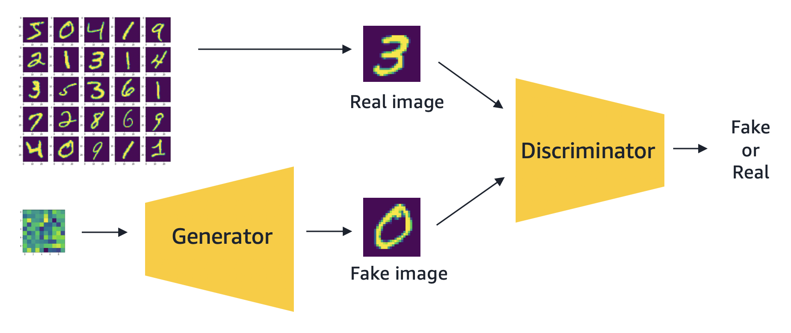
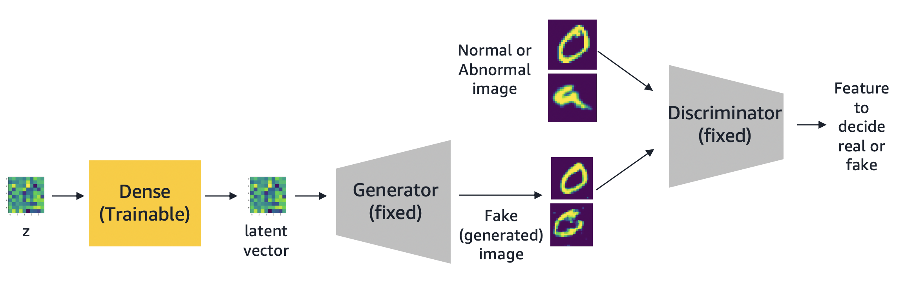

# anogan-mnist (Unsupervised Computer vision based Anomaly Detection)

### GAN(Generative Adversal Network)을 이용한 이상감지

본 노트북은 GAN(Generative Adversal Network)을 이용하여 이미지 데이터에 이상감지를 적용하는 방법을 보여줍니다. 구현원리와 아이디어는 다음 링크의 논문(https://arxiv.org/abs/1703.05921)으로부터 직접 참조할 수 있습니다. 본 예제는 해당 아이디어를 Tensorflow Keras와 SageMaker를 이용하여 MNIST 데이터셋에 이상감지를 적용해 볼 것입니다. GAN네트워크는 다음 링크(https://github.com/eriklindernoren/Keras-GAN/blob/master/dcgan/dcgan.py)의 DC GAN을 참고하였습니다. AnoGAN 구현코드는 다음링크(https://github.com/yjucho1/anoGAN)를 참고하였습니다.

구현단계를 간단히 요약하면 다음과 같습니다.

#### Step 1) 정상 이미지를 이용하여 Generative 모델을 생성한다. 
정상 이미지를 이용하여 이와 유사한 이미지를 만들 수 있는 Generative 모델을 정의하고 학습합니다. 본 예제에서는 28x28 grayscale의 이미지를 생성하는 GAN Network을 정의하고 MNIST 이미지와 유사한 이미지를 생성하도록 Network를 학습시킵니다.

#### Step 2) Generative 모델에서 사용할 latent vector를 추론하는 모델을 생성한다. 
Step 1의 GAN을 이용하여 이상감지 모델을 생성합니다. 학습된 GAN이 정상 데이터와 유사한 이미지는 잘 생성하지만 학습단계에서 보지 못한 이상 데이터와 유사한 데이터는 잘 생성하지 못하는 특징을 활용하여 Anomaly Score를 정량적으로 구합니다.

#### 응용 사례

제조 현장에서 이미지를 기반으로 품질관리를 위해 공정 과정중 카메라를 설치하고 이미지를 촬영하는 유즈케이스를 생각할 수 있습니다. 일반적인 분류기반 머신러닝 알고리즘은 불량에 대한 레이블링이 필요하지만 실제 생산현장에는 불량데이터가 거의 없을 수 있습니다. 하지만 GAN기반의 생성모델을 사용하면 정상데이터를 이용하여 학습을 진행하고 이후 학습에 사용된 정상 데이터 패턴을 벗어나는 데이터가 입력될 때 리턴되는 Abnomaly Score를 이용하여 추가 검수가 필요한 지 여부를 판단할 수 있을 것입니다.

#### 예제 코드
본 예제를 실행하면서 단계별로 그 과정과 설명을 확인할 수 있습니다.  
AWS SageMaker 환경에서 다음 주피터 노트북을 실행하십시오.  
  
[dcgan+anogan.ipynb](dcgan+anogan.ipynb)  

 